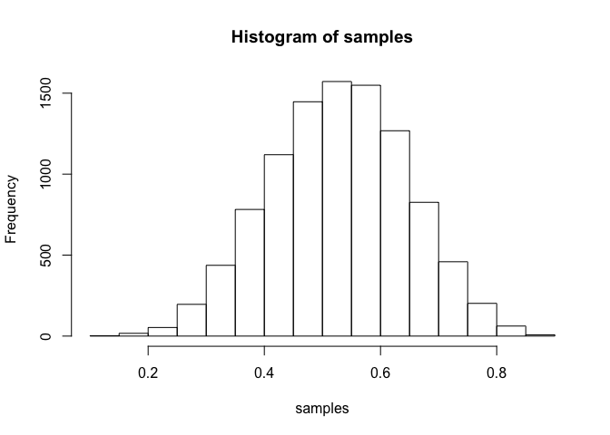
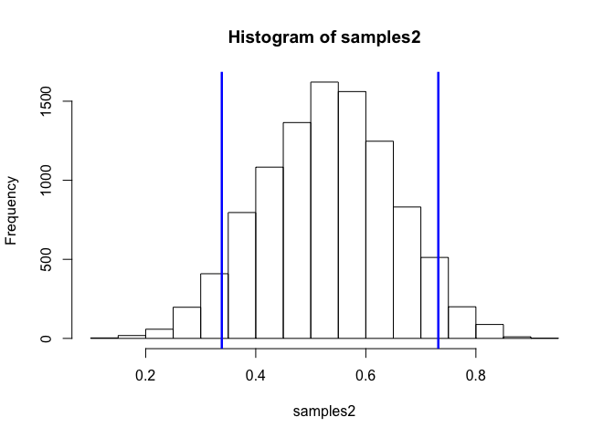

# Statistical Rethinking Chapter 3 problems

__Name:_Sharon Gray_

## 3E1

```r
p_grid <- seq( from=0 , to=1 , length.out=1000 ) 
prior <- rep( 1 , 1000 ) 
likelihood <- dbinom( 6 , size=9 , prob=p_grid ) 
posterior <- likelihood * prior 
posterior <- posterior / sum(posterior) 
set.seed(100) 
samples <- sample( p_grid , prob=posterior , size=1e4 , replace=TRUE )
sum( samples < 0.2 ) / 1e4 #How much posterior prob lies below p=0.2?
```

```
## [1] 5e-04
```
## 3E2

```r
p_grid <- seq( from=0 , to=1 , length.out=1000 ) 
prior <- rep( 1 , 1000 ) 
likelihood <- dbinom( 6 , size=9 , prob=p_grid ) 
posterior <- likelihood * prior 
posterior <- posterior / sum(posterior) 
set.seed(100) 
samples <- sample( p_grid , prob=posterior , size=1e4 , replace=TRUE )
sum( samples > 0.8 ) / 1e4 #How much posterior prob lies above p=0.8?
```

```
## [1] 0.1117
```
## 3E3

```r
p_grid <- seq( from=0 , to=1 , length.out=1000 ) 
prior <- rep( 1 , 1000 ) 
likelihood <- dbinom( 6 , size=9 , prob=p_grid ) 
posterior <- likelihood * prior 
posterior <- posterior / sum(posterior) 
set.seed(100) 
samples <- sample( p_grid , prob=posterior , size=1e4 , replace=TRUE )
sum( samples >0.2 & samples < 0.8 ) / 1e4 #How much posterior prob lies between p=0.2 & p=0.8?
```

```
## [1] 0.8878
```
## 3E4

```r
quantile( samples , 0.2 ) #20% of the posterior probability lies below which value of p?
```

```
##       20% 
## 0.5195195
```
## 3E5

```r
quantile( samples , 0.8 ) #20% of the posterior probability lies above which value of p?
```

```
##       80% 
## 0.7567568
```
## 3E6

```r
library(rethinking)
```

```
## Loading required package: rstan
```

```
## Warning: package 'rstan' was built under R version 3.2.3
```

```
## Loading required package: ggplot2
```

```
## Warning: package 'ggplot2' was built under R version 3.2.3
```

```
## rstan (Version 2.9.0, packaged: 2016-01-05 16:17:47 UTC, GitRev: 05c3d0058b6a)
## For execution on a local, multicore CPU with excess RAM we recommend calling
## rstan_options(auto_write = TRUE)
## options(mc.cores = parallel::detectCores())
## Loading required package: parallel
## rethinking (Version 1.58)
```

```r
HPDI( samples , prob=0.66 ) #Which values of p contain the narrowest interval equal to 66% of the posterior probability?
```

```
##     |0.66     0.66| 
## 0.5205205 0.7847848
```
## 3E7

```r
PI( samples , prob=0.66 ) #Which values of p contain 66% of the posterior probability, assuming equal posterior probability both below and above the interval?
```

```
##       17%       83% 
## 0.5005005 0.7687688
```
## 3M1

```r
p_grid <- seq( from=0 , to=1 , length.out=1000 ) 
prior <- rep( 1 , 1000 ) 
likelihood <- dbinom( 8 , size=15 , prob=p_grid ) 
posterior <- likelihood * prior 
posterior <- posterior / sum(posterior) 
set.seed(100) 
samples <- sample( p_grid , prob=posterior , size=1e4 , replace=TRUE )
hist(samples)
```

 
## 3M2

```r
samples2 <- sample( p_grid , prob=posterior , size=10000 , replace=TRUE)
HPDI( samples2 , prob=0.90 )
```

```
##      |0.9      0.9| 
## 0.3383383 0.7317317
```

```r
hist(samples2)
abline(v=HPDI(samples2, prob=0.90)[1], col="blue", lwd=2.5)
abline(v=HPDI(samples2, prob=0.90)[2], col="blue", lwd=2.5)
```

 

## 3M3

## 3M4

## 3M5

## 3H1

## 3H2

## 3H3

## 3H4

## 3H5
