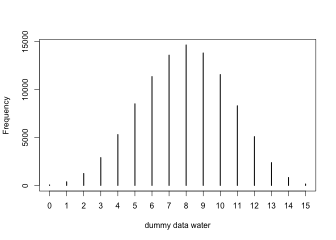
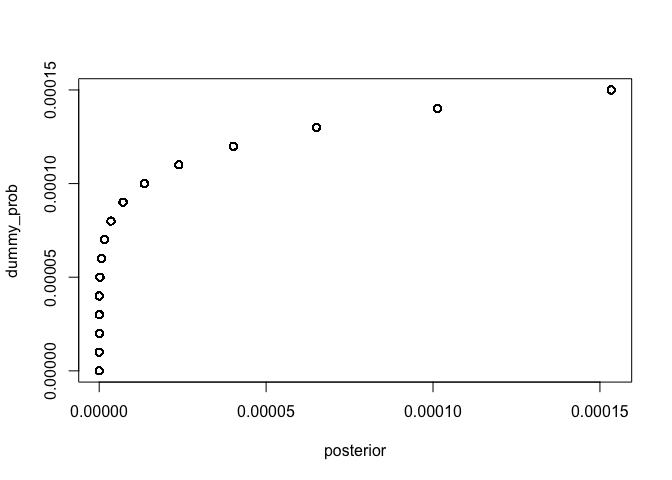
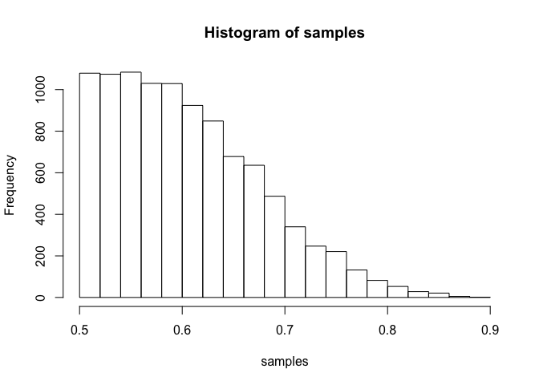
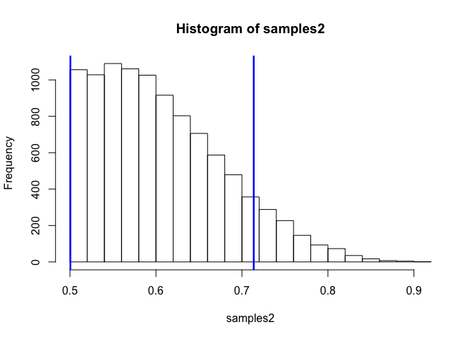
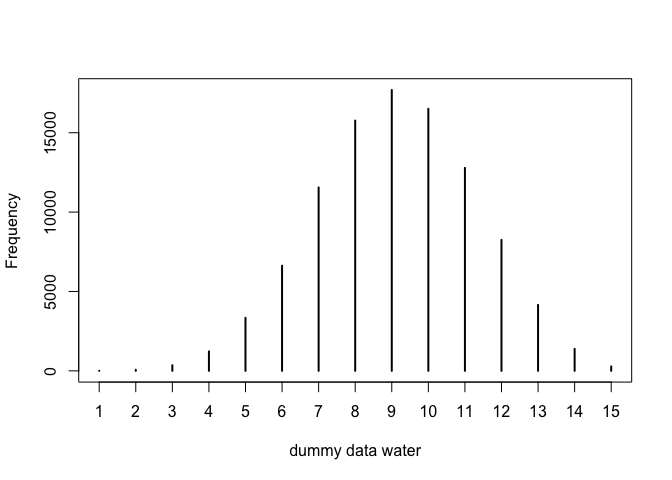
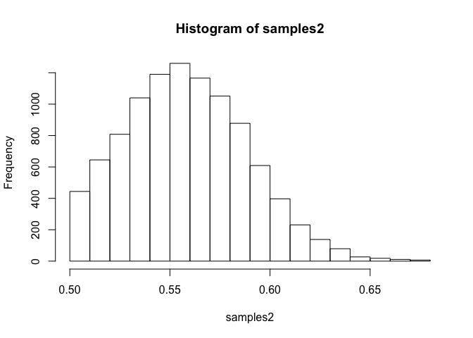
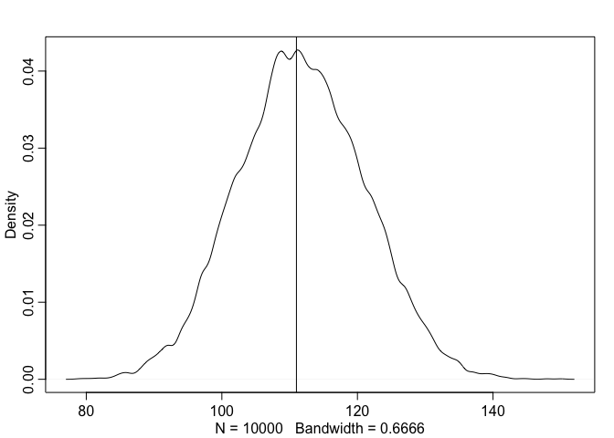
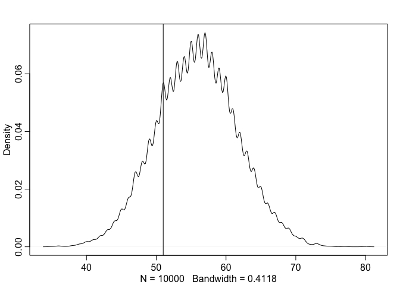
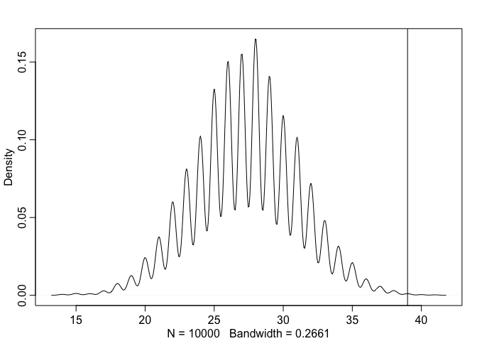

# Statistical Rethinking Chapter 3 problems

__Name:_Sharon Gray_

## 3E1

```r
p_grid <- seq( from=0 , to=1 , length.out=1000 ) 
prior <- rep( 1 , 1000 ) 
likelihood <- dbinom( 6 , size=9 , prob=p_grid ) 
posterior <- likelihood * prior 
posterior <- posterior / sum(posterior) 
set.seed(100) 
samples <- sample( p_grid , prob=posterior , size=1e4 , replace=TRUE )
sum( samples < 0.2 ) / 1e4 #How much posterior prob lies below p=0.2?
```

```
## [1] 5e-04
```
## 3E2

```r
p_grid <- seq( from=0 , to=1 , length.out=1000 ) 
prior <- rep( 1 , 1000 ) 
likelihood <- dbinom( 6 , size=9 , prob=p_grid ) 
posterior <- likelihood * prior 
posterior <- posterior / sum(posterior) 
set.seed(100) 
samples <- sample( p_grid , prob=posterior , size=1e4 , replace=TRUE )
sum( samples > 0.8 ) / 1e4 #How much posterior prob lies above p=0.8?
```

```
## [1] 0.1117
```
## 3E3

```r
p_grid <- seq( from=0 , to=1 , length.out=1000 ) 
prior <- rep( 1 , 1000 ) 
likelihood <- dbinom( 6 , size=9 , prob=p_grid ) 
posterior <- likelihood * prior 
posterior <- posterior / sum(posterior) 
set.seed(100) 
samples <- sample( p_grid , prob=posterior , size=1e4 , replace=TRUE )
sum( samples >0.2 & samples < 0.8 ) / 1e4 #How much posterior prob lies between p=0.2 & p=0.8?
```

```
## [1] 0.8878
```
## 3E4

```r
quantile( samples , 0.2 ) #20% of the posterior probability lies below which value of p?
```

```
##       20% 
## 0.5195195
```
## 3E5

```r
quantile( samples , 0.8 ) #20% of the posterior probability lies above which value of p?
```

```
##       80% 
## 0.7567568
```
## 3E6

```r
library(rethinking)
```

```
## Loading required package: rstan
```

```
## Warning: package 'rstan' was built under R version 3.2.3
```

```
## Loading required package: ggplot2
```

```
## Warning: package 'ggplot2' was built under R version 3.2.3
```

```
## rstan (Version 2.9.0, packaged: 2016-01-05 16:17:47 UTC, GitRev: 05c3d0058b6a)
## For execution on a local, multicore CPU with excess RAM we recommend calling
## rstan_options(auto_write = TRUE)
## options(mc.cores = parallel::detectCores())
## Loading required package: parallel
## rethinking (Version 1.58)
```

```r
HPDI( samples , prob=0.66 ) #Which values of p contain the narrowest interval equal to 66% of the posterior probability?
```

```
##     |0.66     0.66| 
## 0.5205205 0.7847848
```
## 3E7

```r
PI( samples , prob=0.66 ) #Which values of p contain 66% of the posterior probability, assuming equal posterior probability both below and above the interval?
```

```
##       17%       83% 
## 0.5005005 0.7687688
```
## 3M1

```r
p_grid <- seq( from=0 , to=1 , length.out=1000 ) 
prior <- rep( 1 , 1000 ) 
likelihood <- dbinom( 8 , size=15 , prob=p_grid ) 
posterior <- likelihood * prior 
posterior <- posterior / sum(posterior) 
set.seed(100) 
samples <- sample( p_grid , prob=posterior , size=1e4 , replace=TRUE )
hist(samples)
```

 
## 3M2

```r
samples2 <- sample( p_grid , prob=posterior , size=10000 , replace=TRUE)
HPDI( samples2 , prob=0.90 )
```

```
##      |0.9      0.9| 
## 0.3383383 0.7317317
```

```r
hist(samples2)
abline(v=HPDI(samples2, prob=0.90)[1], col="blue", lwd=2.5)
abline(v=HPDI(samples2, prob=0.90)[2], col="blue", lwd=2.5)
```

 

## 3M3

```r
dummy_w <- rbinom( 1e5 , size=15 , prob=samples )
table(dummy_w)/1e5
```

```
## dummy_w
##       0       1       2       3       4       5       6       7       8 
## 0.00053 0.00379 0.01243 0.02900 0.05299 0.08502 0.11340 0.13571 0.14633 
##       9      10      11      12      13      14      15 
## 0.13797 0.11552 0.08297 0.05084 0.02377 0.00824 0.00149
```

```r
simplehist(dummy_w, xlab="dummy data water")
```

 
The probability of observing 8 water in 15 tosses is 14.6%.
## 3M4

```r
p_grid <- seq( from=0 , to=1 , length.out=1000 ) 
prior <- rep( 1 , 1000 ) 
dummy_prob <- (dummy_w)/1e5
likelihood <- dbinom( 6 , size=9 , prob=dummy_prob ) 
posterior <- likelihood * prior 
posterior <- posterior / sum(posterior) 
plot(posterior, dummy_prob)
```

 
## 3M5

```r
p_grid <- seq( from=0 , to=1 , length.out=1000 ) 
prior <- c(rep( 0, 500) , rep(1, 500)) 
likelihood <- dbinom( 8 , size=15 , prob=p_grid ) 
posterior <- likelihood * prior 
posterior <- posterior / sum(posterior) 
set.seed(100) 
samples <- sample( p_grid , prob=posterior , size=1e4 , replace=TRUE )
hist(samples)
```

 

```r
samples2 <- sample( p_grid , prob=posterior , size=10000 , replace=TRUE)
HPDI( samples2 , prob=0.90 )
```

```
##      |0.9      0.9| 
## 0.5005005 0.7137137
```

```r
hist(samples2)
abline(v=HPDI(samples2, prob=0.90)[1], col="blue", lwd=2.5)
abline(v=HPDI(samples2, prob=0.90)[2], col="blue", lwd=2.5)
```

 

```r
dummy_w <- rbinom( 1e5 , size=15 , prob=samples2 )
table(dummy_w)/1e5
```

```
## dummy_w
##       1       2       3       4       5       6       7       8       9 
## 0.00007 0.00068 0.00353 0.01226 0.03343 0.06625 0.11553 0.15765 0.17694 
##      10      11      12      13      14      15 
## 0.16509 0.12787 0.08252 0.04154 0.01385 0.00279
```

```r
simplehist(dummy_w, xlab="dummy data water")
```

 
Now the probability of 8 water in 15 tosses is greater (15.8%) 
## 3H1


```r
library(rethinking) 
data(homeworkch3)
sum(birth1) + sum(birth2)
```

```
## [1] 111
```

```r
p_grid <- seq( from=0 , to=1 , length.out=1000 )
likelihood <- dbinom(111, size=200, prob=p_grid)
posterior <- likelihood * prior 
posterior <- posterior / sum(posterior)
loss <- sapply( p_grid , function(d) sum( posterior*abs( d - p_grid)))
p_grid[which.min(loss)]
```

```
## [1] 0.5575576
```
0.55
## 3H2

```r
samples2 <- sample( p_grid , prob=posterior , size=10000 , replace=TRUE)
HPDI( samples2 , prob=0.50 )
```

```
##      |0.5      0.5| 
## 0.5355355 0.5775776
```

```r
HPDI( samples2 , prob=0.89 )
```

```
##     |0.89     0.89| 
## 0.5065065 0.6006006
```

```r
HPDI( samples2 , prob=0.97 )
```

```
##     |0.97     0.97| 
## 0.5005005 0.6196196
```

```r
hist(samples2)
```

 
## 3H3

```r
w <- rbinom( 10000 , size=200 , prob=samples2 )
dens(w)
abline(v=111)
```

 
## 3H4

```r
sum(birth1)
```

```
## [1] 51
```

```r
w2 <- rbinom( 10000 , size=100 , prob=samples2 )
dens(w2)
abline(v=51)
```

 
bad model.
## 3H5

```r
girls <- 100-sum(birth1)
girlsfirst <- birth2[which(birth1==0)]
sum(girlsfirst)
```

```
## [1] 39
```

```r
sum(girlsfirst)/length(girlsfirst)
```

```
## [1] 0.7959184
```

```r
w3 <- rbinom( 10000 , size=49 , prob=samples2 )
dens(w3)
abline(v=39)
```

 

```r
table(w3)/10000
```

```
## w3
##     14     15     16     17     18     19     20     21     22     23 
## 0.0004 0.0008 0.0007 0.0019 0.0051 0.0085 0.0163 0.0252 0.0403 0.0548 
##     24     25     26     27     28     29     30     31     32     33 
## 0.0689 0.0887 0.1014 0.1047 0.1113 0.0949 0.0773 0.0685 0.0485 0.0323 
##     34     35     36     37     38     39     40     41 
## 0.0212 0.0141 0.0071 0.0039 0.0020 0.0007 0.0003 0.0002
```
Boys are more likely after the first birth is a girl.
The probability of getting 39 girl-boy events is only 0.0013, under the flat prior, and assuming the births were independent.
