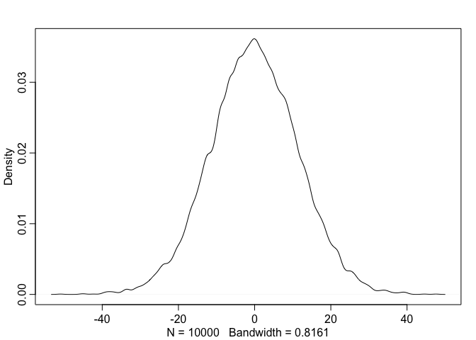
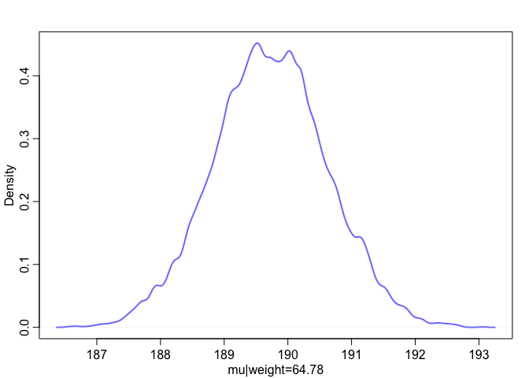

# Statistical Rethinking Chapter 4 problems

__Name:_Sharon Gray_


# For 03/17/16

## 4E1
The first line is the likelihood. yi~Normal(mu, sigma)

## 4E2
The posterior distribution includes 2 parameters: the mean (mu) and the standard deviation (sigma).

## 4E3
Pr(mu, sigma | y)= Normal(yi|mu, sigma)Normal(mu|0,10)Uniform(sigma|0,10)/
(integral(Normal(hi|mu, sigma)Normal(mu|0,10)Uniform(sigma|0,10)))d(mu)d(sigma)


## 4M1

```r
library(rethinking)
```

```
## Loading required package: rstan
```

```
## Warning: package 'rstan' was built under R version 3.2.3
```

```
## Loading required package: ggplot2
```

```
## Warning: package 'ggplot2' was built under R version 3.2.3
```

```
## rstan (Version 2.9.0, packaged: 2016-01-05 16:17:47 UTC, GitRev: 05c3d0058b6a)
## For execution on a local, multicore CPU with excess RAM we recommend calling
## rstan_options(auto_write = TRUE)
## options(mc.cores = parallel::detectCores())
## Loading required package: parallel
## rethinking (Version 1.58)
```

```r
sample_mu <- rnorm( 1e4 , 0 , 10 ) 
sample_sigma <- runif( 1e4 , 0 , 10 ) 
prior_h <- rnorm( 1e4 , sample_mu , sample_sigma ) 
dens( prior_h )
```

 

```r
prior_h <- as.data.frame(prior_h)
```
## 4M2

```r
library(rethinking)
data(Howell1)
d <- Howell1
d2 <- d[ d$age >= 18 , ]
flist <- alist(
  height ~ dnorm( mu , sigma ) , 
  mu ~ dnorm( 0 , 10 ) , 
  sigma ~ dunif( 0 , 10 )
)
m4.1 <- map( flist , data=d2 )
precis( m4.1 )
```

```
##         Mean StdDev   5.5%  94.5%
## mu    154.33   0.41 153.68 154.99
## sigma   7.74   0.29   7.27   8.20
```
# For 03/24/16

##4E4
line 2

##4E5
three parameters: alpha and beta and sigma

## 4M3
yi ~ Normal(mui, sigma)
mui = alpha + beta*xi
alpha ~ Normal(0, 50)
beta ~uniform(0,10)
sigma ~ uniform(0,50)
## 4M4
hi ~ Normal(mui, sigma)
mui = alpha + beta*xi
alpha ~ Normal(147, 50)
beta ~uniform(6,12)
sigma ~ uniform(0,50)

## 4M5
I already am using a positive value of beta to represent growth (height increase every year), so I don't need to change that, but I would change my mean value of alpha (the intercept) to 120.
## 4M6
I would change the sigma estimate to 
sigma ~ uniform(64,0)
This would assume that the variance is always 64, which is conservative since it may at times be smaller.
I would also change the alpha estimate to 
alpha ~Normal(120,64) so that, even at time=0 the sigma value of 64 is observed.
# For 03/31/16

## 4H1

```r
library(rethinking) 
  data(Howell1) 
  d <- Howell1 
  str(d)
```

```
## 'data.frame':	544 obs. of  4 variables:
##  $ height: num  152 140 137 157 145 ...
##  $ weight: num  47.8 36.5 31.9 53 41.3 ...
##  $ age   : num  63 63 65 41 51 35 32 27 19 54 ...
##  $ male  : int  1 0 0 1 0 1 0 1 0 1 ...
```

```r
 m4.3 <- map( 
  alist(
  height ~ dnorm( mu , sigma ) , 
  mu <- a + b*weight , 
  a ~ dnorm( 156 , 100 ) , 
  b ~ dnorm( 0 , 10 ) , 
  sigma ~ dunif( 0 , 50 )
), 
data=d )
precis(m4.3, corr=TRUE) 
```

```
##        Mean StdDev  5.5% 94.5%     a     b sigma
## a     75.45   1.05 73.77 77.12  1.00 -0.92     0
## b      1.76   0.03  1.72  1.81 -0.92  1.00     0
## sigma  9.35   0.28  8.89  9.80  0.00  0.00     1
```

```r
post <- extract.samples( m4.3 )
#46.95
  mu_at_46.95 <- post$a + post$b * 46.95
  dens( mu_at_46.95 , col=rangi2 , lwd=2 , xlab="mu|weight=46.95" )
```

 

```r
  HPDI(mu_at_46.95, prob=0.89)
```

```
##    |0.89    0.89| 
## 157.4389 159.0693
```

```r
  weight.seq <- 46.95
  mu <- link( m4.3 , data=data.frame(weight=weight.seq) ) 
```

```
## [ 100 / 1000 ]
[ 200 / 1000 ]
[ 300 / 1000 ]
[ 400 / 1000 ]
[ 500 / 1000 ]
[ 600 / 1000 ]
[ 700 / 1000 ]
[ 800 / 1000 ]
[ 900 / 1000 ]
[ 1000 / 1000 ]
```

```r
  str(mu)
```

```
##  num [1:1000, 1] 158 159 158 158 159 ...
```

```r
  mu.mean <- apply( mu , 2 , mean ) 
  mu.mean
```

```
## [1] 158.266
```

```r
 #43.72 
 mu_at_43.72 <- post$a + post$b * 43.72
  dens( mu_at_43.72 , col=rangi2 , lwd=2 , xlab="mu|weight=43.72" )
```

 

```r
  HPDI(mu_at_43.72, prob=0.89)
```

```
##    |0.89    0.89| 
## 151.8535 153.3155
```

```r
  weight.seq <- 43.72
  mu <- link( m4.3 , data=data.frame(weight=weight.seq) ) 
```

```
## [ 100 / 1000 ]
[ 200 / 1000 ]
[ 300 / 1000 ]
[ 400 / 1000 ]
[ 500 / 1000 ]
[ 600 / 1000 ]
[ 700 / 1000 ]
[ 800 / 1000 ]
[ 900 / 1000 ]
[ 1000 / 1000 ]
```

```r
  str(mu)
```

```
##  num [1:1000, 1] 152 152 153 153 153 ...
```

```r
  mu.mean <- apply( mu , 2 , mean ) 
  mu.mean
```

```
## [1] 152.5733
```

```r
  #64.78 
 mu_at_64.78 <- post$a + post$b * 64.78
  dens( mu_at_64.78 , col=rangi2 , lwd=2 , xlab="mu|weight=64.78" )
```

 

```r
  HPDI(mu_at_64.78, prob=0.89)
```

```
##    |0.89    0.89| 
## 188.3499 191.2088
```

```r
  weight.seq <- 64.78
  mu <- link( m4.3 , data=data.frame(weight=weight.seq) ) 
```

```
## [ 100 / 1000 ]
[ 200 / 1000 ]
[ 300 / 1000 ]
[ 400 / 1000 ]
[ 500 / 1000 ]
[ 600 / 1000 ]
[ 700 / 1000 ]
[ 800 / 1000 ]
[ 900 / 1000 ]
[ 1000 / 1000 ]
```

```r
  str(mu)
```

```
##  num [1:1000, 1] 189 189 188 190 189 ...
```

```r
  mu.mean <- apply( mu , 2 , mean ) 
  mu.mean
```

```
## [1] 189.7347
```

```r
   #32.59 
 mu_at_32.59 <- post$a + post$b * 32.59
  dens( mu_at_32.59 , col=rangi2 , lwd=2 , xlab="mu|weight=32.59" )
```

 

```r
  HPDI(mu_at_32.59, prob=0.89)
```

```
##    |0.89    0.89| 
## 132.2985 133.6176
```

```r
  weight.seq <- 32.59
  mu <- link( m4.3 , data=data.frame(weight=weight.seq) ) 
```

```
## [ 100 / 1000 ]
[ 200 / 1000 ]
[ 300 / 1000 ]
[ 400 / 1000 ]
[ 500 / 1000 ]
[ 600 / 1000 ]
[ 700 / 1000 ]
[ 800 / 1000 ]
[ 900 / 1000 ]
[ 1000 / 1000 ]
```

```r
  str(mu)
```

```
##  num [1:1000, 1] 133 132 133 133 134 ...
```

```r
  mu.mean <- apply( mu , 2 , mean ) 
  mu.mean
```

```
## [1] 132.941
```

```r
  #54.63 
 mu_at_54.63 <- post$a + post$b * 54.63
  dens( mu_at_54.63 , col=rangi2 , lwd=2 , xlab="mu|weight=54.63" )
```

 

```r
  HPDI(mu_at_54.63, prob=0.89)
```

```
##    |0.89    0.89| 
## 170.7999 172.9098
```

```r
  weight.seq <- 54.63
  mu <- link( m4.3 , data=data.frame(weight=weight.seq) ) 
```

```
## [ 100 / 1000 ]
[ 200 / 1000 ]
[ 300 / 1000 ]
[ 400 / 1000 ]
[ 500 / 1000 ]
[ 600 / 1000 ]
[ 700 / 1000 ]
[ 800 / 1000 ]
[ 900 / 1000 ]
[ 1000 / 1000 ]
```

```r
  str(mu)
```

```
##  num [1:1000, 1] 173 171 172 170 172 ...
```

```r
  mu.mean <- apply( mu , 2 , mean ) 
  mu.mean
```

```
## [1] 171.7978
```
observation	weight	expected height	89% HPDI
1	46.95	158.2674	157.5-159.1
2	43.72	152.5759	151.86-153.33
3	64.78	189.6565	188.34-191.22
4	32.59	132.9472	132.27-133.57
5	54.63	171.8163	170.67-172.88
## 4H2

```r
library(rethinking) 
  data(Howell1) 
  d2 <- d[ d$age < 18 , ] 
  str(d2)
```

```
## 'data.frame':	192 obs. of  4 variables:
##  $ height: num  121.9 105.4 86.4 129.5 109.2 ...
##  $ weight: num  19.6 13.9 10.5 23.6 16 ...
##  $ age   : num  12 8 6.5 13 7 17 16 11 17 8 ...
##  $ male  : int  1 0 0 1 0 1 0 1 0 1 ...
```

```r
  m4.3 <- map( 
  alist(
  height ~ dnorm( mu , sigma ) , 
  mu <- a + b*weight , 
  a ~ dnorm( 156 , 100 ) , 
  b ~ dnorm( 0 , 10 ) , 
  sigma ~ dunif( 0 , 50 )
), 
data=d2 )
precis(m4.3, corr=TRUE)
```

```
##        Mean StdDev  5.5% 94.5%    a    b sigma
## a     58.25   1.40 56.02 60.48  1.0 -0.9     0
## b      2.72   0.07  2.61  2.83 -0.9  1.0     0
## sigma  8.44   0.43  7.75  9.13  0.0  0.0     1
```
 
 
  Ran out of time to finish this...
  
## 4H3
