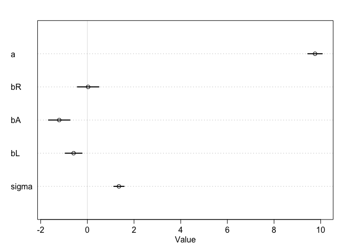

# Statistical Rethinking Chapter 4 problems

__Name:__Sharon Gray


# For 04/11/2016

## 5E1
2, 3 and 4 are multiple linear regressions.


## 5E2
mu <- a + b1*p.diversity + b2*latitude


## 5M1
plant_growth_rate <- a + b1*CO2 + b2*talking_to_plants 


## 5M3
When the divorce rate is high, more people will have multiple marriages in their lifetime, resulting in a higher marriage rate. We could evaluate this using predictor residual plots.  


## 5M4
merge is better than cbind because you can use by statements to make sure it lines up

```r
setwd("/Users/sharongray/Rclub-rethinking_Sharon.Gray/Assignment_Chapter_05")
LDS <- read.csv("LDS.csv")
library(rethinking)
```

```
## Loading required package: rstan
```

```
## Warning: package 'rstan' was built under R version 3.2.3
```

```
## Loading required package: ggplot2
```

```
## Warning: package 'ggplot2' was built under R version 3.2.3
```

```
## rstan (Version 2.9.0, packaged: 2016-01-05 16:17:47 UTC, GitRev: 05c3d0058b6a)
## For execution on a local, multicore CPU with excess RAM we recommend calling
## rstan_options(auto_write = TRUE)
## options(mc.cores = parallel::detectCores())
## Loading required package: parallel
## rethinking (Version 1.58)
```

```r
data(WaffleDivorce)
LDS_marriage <- merge(LDS, WaffleDivorce, by.x="Location", by.y="Location")
#LDS_marriage <-cbind(LDS, WaffleDivorce)
head(LDS_marriage)
```

```
##     Location Membership Population.x percent_LDS Loc Population.y
## 1    Alabama      36547      4849377      0.0075  AL         4.78
## 2     Alaska      33375       736732      0.0453  AK         0.71
## 3    Arizona     416192      6731484      0.0618  AZ         6.33
## 4   Arkansas      29898      2966369      0.0100  AR         2.92
## 5 California     778629     38802500      0.0201  CA        37.25
## 6   Colorado     151523      5355866      0.0282  CO         5.03
##   MedianAgeMarriage Marriage Marriage.SE Divorce Divorce.SE WaffleHouses
## 1              25.3     20.2        1.27    12.7       0.79          128
## 2              25.2     26.0        2.93    12.5       2.05            0
## 3              25.8     20.3        0.98    10.8       0.74           18
## 4              24.3     26.4        1.70    13.5       1.22           41
## 5              26.8     19.1        0.39     8.0       0.24            0
## 6              25.7     23.5        1.24    11.6       0.94           11
##   South Slaves1860 Population1860 PropSlaves1860
## 1     1     435080         964201           0.45
## 2     0          0              0           0.00
## 3     0          0              0           0.00
## 4     1     111115         435450           0.26
## 5     0          0         379994           0.00
## 6     0          0          34277           0.00
```

```r
#standardize variables
LDS_marriage$Marriage.s <- (LDS_marriage$Marriage - mean(LDS_marriage$Marriage))/sd(LDS_marriage$Marriage)
LDS_marriage$MedianAgeMarriage.s <- (LDS_marriage$MedianAgeMarriage - mean(LDS_marriage$MedianAgeMarriage))/sd(LDS_marriage$MedianAgeMarriage)
LDS_marriage$percent_LDS.s <- (LDS_marriage$percent_LDS - mean(LDS_marriage$percent_LDS))/sd(LDS_marriage$percent_LDS)
#model where divorce is predicted by marriage rate, median marriage age, and percent LDS
#each beta is normally distributed with a mean of 0 and SD of 1
#the intercept is normally distributed with a mean of 10 and SD of 10
#sigma is uniformly distributed
model_LDS <- map(
    alist(
      Divorce ~ dnorm(mu, sigma),
      mu <- a + bR*Marriage.s + bA*MedianAgeMarriage.s + bL*percent_LDS.s,
      a ~ dnorm(10, 10),
      bR ~ dnorm(0, 1),
      bA ~ dnorm(0,1),
      bL ~ dnorm(0,1),
      sigma ~ dunif(0,10)
    ) ,
    data = LDS_marriage)
precis(model_LDS)
```

```
##        Mean StdDev  5.5% 94.5%
## a      9.76   0.19  9.45 10.07
## bR     0.03   0.29 -0.43  0.49
## bA    -1.21   0.29 -1.66 -0.75
## bL    -0.59   0.23 -0.95 -0.23
## sigma  1.35   0.14  1.13  1.57
```

```r
plot(precis(model_LDS))
```

 
    head(LDS)
    
